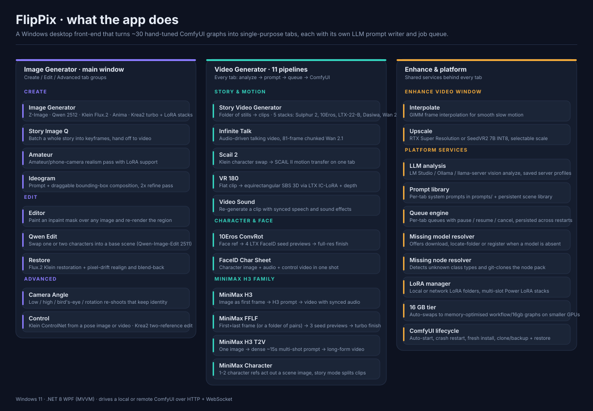
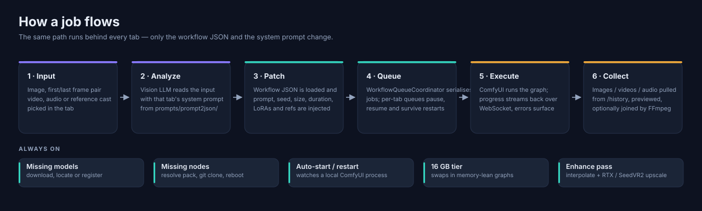

<div align="center">


**A Windows desktop studio for AI image and video generation.**

FlipPix turns ~30 hand-tuned ComfyUI graphs into single-purpose tabs — each one with its own
vision-LLM prompt writer, its own job queue, and no graph editing required.

[Quick start](QUICKSTART.md) · [ComfyUI setup](COMFYUI_SETUP.md) · [Setup scripts](scripts/README.md) · [Architecture](architecture.md)

</div>

---

## What's in the app



FlipPix opens on the **Image Generator** window. A nav bar at the top jumps to the **Video
Generator** and **Enhance Video** windows; three pills (Create / Edit / Advanced) switch which
set of image tabs is visible.

---

## Feature catalogue

### 🎨 Image Generator window

| Group | Tab | What it does |
|---|---|---|
| Create | **🎨 Image Generator** | Text-to-image across five stacks — Z-Image, Qwen 2512 (INT8 ConvRot + Lightning), Klien (Flux.2), Anima, and Krea2 Turbo. LoRA support per stack, including multi-slot Power-LoRA stacks for Krea2. Aspect presets (1:1, 3:4, 9:16, 4:3, 16:9) plus steps/CFG/seed. Can also run from an image analysis instead of a typed prompt. |
| Create | **📖 Story Image Q** | Batch a whole story into keyframes in one pass, then hand the generated frames straight to the Video Generator's MiniMax FFLF tab as overlapping first/last-frame pairs. |
| Create | **📷 Amateur** | Amateur / phone-camera realism generation with its own LoRA selection. |
| Create | **🔤 Ideogram** | High-level prompt plus a canvas of draggable bounding boxes that define composition. Renders at the chosen base resolution then does a 2× latent upscale + refine pass. |
| Edit | **✏️ Editor** | Paint a mask over any image with an adjustable brush and re-render just that region. |
| Edit | **🧑‍🤝‍🧑 Qwen Edit** | Character swap: two character references dropped into a base scene. Analyze sends all three images to the LLM, which writes one Qwen-Image-Edit-2511 instruction that swaps the people and leaves the scene alone. |
| Edit | **♻️ Restore** | Flux.2 Klein restoration pass — upscale to a megapixel budget, re-render with a guidance prompt, then realign (pixel-drift fix) and blend back over the original. |
| Advanced | **🎥 Camera Angle** | Re-shoot a photo from a new angle — low, high, bird's-eye, rotation — while preserving identity, clothing and pose. |
| Advanced | **🎛️ Control** | Two modes: *Klein Flux.2 ControlNet* (subject reference + a pose image or video, with QwenVL writing the prompt) and *Krea2 two-reference edit* (scene image A + subject image B + an edit instruction). |

### 🎬 Video Generator window

| Tab | What it does |
|---|---|
| **📖 Story Video Generator** | The batch workhorse: a folder of stills and a prompt JSON become a queue of clips. Five selectable stacks — 🟢 Vantage Sulphur 2, 🟠 10Eros InstantAction, 🔵 LTX-22-B, Dasiwa Wan 2.2 (autoregressive chain where each clip's last frame seeds the next), and Wan 2.2 I2V. |
| **🎤 Infinite Talk** | Audio-driven talking video on Wan 2.1 InfiniteTalk, processed in 81-frame chunks so long audio works. |
| **🎭 Scail 2** | Unified character-swap → motion-transfer flow: a Klein pass swaps the character, then SCAIL II transfers motion from a reference video. Includes trim in/out scrubbing and a "keep original background" option to fight autoregressive drift. |
| **🥽 VR 180** | Flat clip → side-by-side 3D VR180, by outpainting each frame with the LTX-2.3 equirect IC-LoRA, deriving depth, and doing DIBR/SBS in FFmpeg. Adjustable stereo strength. |
| **🔊 Video Sound** | Upload a clip, analyze its first frame into a `[VISUAL]` / `[SPEECH]` / `[SOUNDS]` directing script, then regenerate it through the LTX-2.3 audio-video workflow with synced speech and effects. Optional voice reference. |
| **🎭 10Eros ConvRot** | Seed hunting for faces: one face reference + a prompt yields 4 cheap LTX-2.3 FaceID previews (reroll for more), then the chosen seed(s) re-render at full resolution. |
| **🪪 FaceID Char Sheet** | One-shot LTX-2.3 FaceID + Union-Control video from a character image (with Analyze), an audio track, and a reference video supplying pose/depth/edge control. |
| **🌀 MiniMax H3** | Image-to-video with synchronized audio: the uploaded image is the first frame, Analyze turns it into a full four-block H3 prompt, one video comes out. |
| **🌀🎯 MiniMax FFLF** | The seed-hunter pattern on first/last-frame generation. Give it a frame pair — or a folder, which it pairs up by creation time into overlapping segments — get 3 cheap previews per pair, pick, then finish at full res and join. |
| **🌀📝 MiniMax H3 T2V** | Long-form: one image is analyzed into a dense ~15-second, 9–14 shot H3 prompt. Toggle whether the image is conditioned as the first frame or used only as inspiration for a true text-to-video run. |
| **🎭👥 MiniMax Character** | Reference-to-video: one or two character images stay on-model as H3 reference frames while a third *scene* image (never uploaded — only the LLM sees it) is analyzed into the prompt they act out. Story mode writes a run of clips for a 5–120 s target and queues one job per clip. Scenes are saved to a persistent scene library. |

### ✨ Enhance Video window

| Tab | What it does |
|---|---|
| **🎞 Interpolate** | GIMM frame interpolation for smooth slow motion, queued like everything else. |
| **🔍 Upscale** | RTX Super Resolution or SeedVR2 7B INT8, with a selectable pre-resize multiplier that decides the output resolution. |

---

## How a job flows



Every tab runs the same path — only the workflow JSON and the system prompt change:

1. **Input** — an image, a first/last frame pair, a video, audio, or a reference cast.
2. **Analyze** — a vision LLM (LM Studio, Ollama, or a llama-server) reads the input using that
   tab's system prompt from `prompts/prompt2json/`, and writes the generation prompt. You can
   always edit the result before generating.
3. **Patch** — the workflow JSON is loaded and the prompt, seed, resolution, duration, LoRAs and
   uploaded references are injected into the right node inputs. Unused branches are pruned.
4. **Queue** — `WorkflowQueueCoordinator` serialises execution so only one graph runs at a time.
   Per-tab queues pause, resume, cancel, and are persisted across restarts.
5. **Execute** — ComfyUI runs the graph; progress streams back over WebSocket. Validation
   errors (`node_errors`) and execution errors surface as real failures instead of silent hangs.
6. **Collect** — outputs are pulled from `/history` (images, videos, gifs and audio), previewed
   in-app, and optionally joined with FFmpeg.

Along the way, three safety nets are always on:

- **Missing models** — if a checkpoint/LoRA/VAE the graph needs isn't installed, FlipPix offers to
  download it from the model catalog, locate an existing copy on disk (and remember it), or register it.
- **Missing nodes** — an unknown `class_type` is resolved to its custom-node pack via the node
  catalog and ComfyUI-Manager mappings, then git-cloned, pip-installed, and the server rebooted.
- **VRAM tier** — on ~16 GB GPUs FlipPix loads the memory-optimised graphs from `workflow/16gb`
  instead of crashing. Auto-detected from the connected server, or forced in Settings.

---

## Requirements

| | |
|---|---|
| OS | Windows 10/11 x64 |
| Runtime | .NET 8 (bundled in the self-contained build) |
| RAM | 16 GB minimum, 32 GB recommended for video |
| GPU | NVIDIA, 12 GB VRAM minimum; 16 GB triggers the memory-optimised tier; 24 GB+ recommended for the video tabs |
| Storage | ~60 GB for models and dependencies (much more if you install every stack) |
| Server | A reachable ComfyUI — local or remote — default `http://127.0.0.1:8188` |
| Optional | LM Studio / Ollama / llama-server for the Analyze buttons; FFmpeg for joining and enhancement |

---

## Install

**New here? Start with [QUICKSTART.md](QUICKSTART.md).**

1. Double-click **`Install-FlipPix.bat`** — a small wizard that installs the app and can also set
   up ComfyUI for you.
2. Or grab the built app and run `publish\FlipPix.UI.exe`.

On first launch FlipPix asks whether your ComfyUI is **local** or **remote** and walks you
through pointing at it. Everything else (server URL, output folder, LoRA folders, LLM server
profiles, auto-restart) lives in **⚙️ Settings**.

### Getting a ComfyUI that works

FlipPix needs a ComfyUI with a specific set of custom nodes. Two ways to get one:

#### Option A — Clone a ready-made ComfyUI ⭐ (lowest friction)

Restore a snapshot of a known-good install. The snapshot bundles the entire Python environment
*and* every custom node, so restoring is extract + run — no pip, no missing-node hunts.

1. **(Maintainer, once)** Double-click **`Backup-ComfyUI.bat`** on the live ComfyUI box → produces a
   `.tar.gz` (~15 GB) + `.sha256` in `%USERPROFILE%\FlipPix-ComfyUI-Backup`. Upload both to a
   Hugging Face model repo (the script prints the `hf upload` commands).
2. **(Each user)** On a Linux GPU box or WSL, one command downloads, verifies and restores it:
   ```bash
   bash restore-comfyui.sh --hf <user>/flippix-comfyui
   cd ~/flippix-comfyui/ && ./run_nvidia_gpu.sh    # ComfyUI on 0.0.0.0:8188
   ```
   Needs an NVIDIA GPU + recent driver (in WSL, a current Windows NVIDIA driver exposes it).

Models aren't bundled — they can be hundreds of GB. After restoring, point `ComfyUI/models` at
your weights or use the model manifest (`scripts/flippix-models.txt`). Details:
**[scripts/README.md → Backup / Restore](scripts/README.md#backup--restore-a-working-comfyui-clone-an-existing-install)**.

#### Option B — Fresh install on Windows

Double-click **`Install-ComfyUI.bat`** (or tick "Also install ComfyUI" in the FlipPix wizard) to
provision a self-contained ComfyUI — bundled Python + torch/CUDA — auto-install all FlipPix custom
nodes, and optionally download models. `Install-ComfyUI-Minimal.bat` installs a trimmed node set;
`Install-ComfyUI-WSL.bat` does the WSL variant.

- **📖 [Complete ComfyUI setup guide](COMFYUI_SETUP.md)** — manual, step by step
- **🚀 [Automated setup scripts](scripts/README.md)** — install, backup, restore, model manifests
- Node list: `scripts/flippix-custom-nodes.txt` · Models: `scripts/flippix-models.txt`

Key node packs the workflows depend on include ComfyUI-Manager, the kijai stack (KJNodes,
WanVideoWrapper, Florence2, SAM2, GIMM-VFI, MMAudio), Lightricks' LTXVideo nodes, rgthree-comfy,
Comfyroll, VideoHelperSuite, controlnet_aux and ComfyUI-GGUF — 29 packs in total, listed with the
nodes each one provides in `scripts/flippix-custom-nodes.txt`. Anything still missing is picked up
by the in-app missing-node resolver on demand.

---

## Project structure

```
flippix/
├── FlipPix.Core/                 # Models, interfaces, settings + image analysis services
├── FlipPix.ComfyUI/              # ComfyUI integration
│   ├── Http/                     #   uploads, prompt submission, /history, health checks
│   ├── WebSocket/                #   live progress + execution errors
│   └── Services/                 #   orchestration, local process manager (auto-start/restart)
├── FlipPix.UI/                   # WPF app (MVVM)
│   ├── ImageGeneratorWindow      #   startup window — Create / Edit / Advanced tabs
│   ├── VideoGeneratorWindow      #   11 video pipelines
│   ├── VideoEnhanceWindow        #   interpolate + upscale
│   ├── ViewModels/               #   one ViewModel per tab (ViewModels/Video/* for video)
│   ├── Services/                 #   LLM clients, LoRA manager, model/node installers, queues
│   ├── Controls/ · Themes/       #   SectionHeader, log panel, shared design tokens
│   └── Models/                   #   queue items, prompt data, LLM API types
├── FlipPix.UI.Linux/             # Experimental Avalonia port
├── workflow/                     # ComfyUI graphs (API format), grouped by domain
│   ├── image/{zimage,qwen,qwen-edit,klein,krea,anima,ideogram}/
│   ├── video/{ltx,wan,h3-minimax,story}/
│   └── 16gb/                     #   memory-optimised variants for smaller GPUs
├── prompts/prompt2json/          # One system prompt per tab (h3minimax.md, vr180.md, …)
├── scripts/                      # Installers, backup/restore, model + node manifests
├── tools/                        # Workflow conversion + audit helpers
├── docs/                         # README diagrams (regenerate: python docs/make-diagrams.py)
└── publish/                      # Built self-contained app
```

### Where things live at runtime

| Path | Contents |
|---|---|
| `%APPDATA%\FlipPix\settings.json` | Server URLs, folders, LLM server profiles, VRAM tier |
| `%APPDATA%\FlipPix\logs\` | Serilog file logs |
| `%APPDATA%\FlipPix\prompts\` | Saved prompts and the scene library (`scenes\index.json` + thumbnails) |
| ComfyUI output folder | Generated images and videos (set in Settings) |

---

## Building from source

```bash
./publish.bat        # self-contained win-x64 build into publish/

# or manually
dotnet publish FlipPix.UI/FlipPix.UI.csproj -c Release -r win-x64 --self-contained true
```

Stack: .NET 8 · WPF · MVVM (CommunityToolkit.Mvvm 8.2.2) · Microsoft.Extensions.DependencyInjection ·
Serilog · FFMpegCore · System.Text.Json · YamlDotNet.

A note for contributors: XAML resource keys and `Style TargetType` mismatches compile cleanly and
only blow up when the window loads, so run the app (or the verification scripts) after touching
styles — don't trust a green build.

---

## Troubleshooting

**FlipPix can't reach ComfyUI** — confirm it's serving on the URL in Settings, check the firewall,
and make sure nothing else holds port 8188. For a remote box, ComfyUI must listen on `0.0.0.0`.

**"Missing node" or "missing model" dialog** — accept the offer to install; it clones the node pack
or downloads/locates the weight and remembers the location. If you decline, the job can't run.

**Workflow finishes in ComfyUI but the app keeps waiting** — usually a new output type. FlipPix
reads `images`, `videos`, `gifs` and `audio` from `/history`; a node emitting anything else needs
support added.

**Out of memory** — force 16 GB mode in Settings (loads `workflow/16gb` graphs), lower the
resolution or duration, and close other GPU applications.

**Slow startup or a slow window open** — usually a network drive. FlipPix defers queue and gallery
loading off the UI thread and caches FFmpeg probing; if a mapped drive is dead, unmap it.

**Analyze does nothing** — check the LLM server profile in Settings; the status line under the
button names the exact server and model it's talking to.

---

## Contributing

Useful directions: new workflow stacks (add the API JSON + a tab ViewModel + a system prompt),
model/node catalog coverage, UI polish against the shared design tokens, and performance work on
the startup path.

## License

Provided as-is for personal and educational use.
