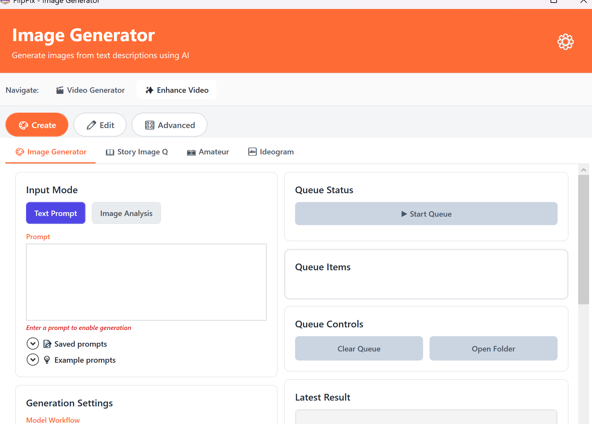

# FlipPix



AI-powered creative platform for image processing, video generation, and multimedia content creation. FlipPix integrates multiple AI models through ComfyUI to provide camera angle transformations, video animation, image generation, and story creation capabilities.

## Quick Start

**New to FlipPix?** Get up and running fast!

→ **[QUICKSTART.md](QUICKSTART.md)** - 3-step installation guide with automated setup

## Overview

FlipPix is a comprehensive AI content creation platform offering:

- **Image Generation**: Text-to-image creation with Z-Image models and amateur-style generation
- **Video Generation**: Image-to-video animation with LTX, Painter, and Wan video models
- **Camera Angle Transformations**: Qwen-powered perspective changes and camera movement
- **Story Creation**: AI-powered narrative and visual story generation (WCFM)
- **Image Analysis**: AI-powered image understanding and description
- **Story Editing**: Qwen Rapid Edit for story image modification
- **Multimodal Integration**: Image-to-video-to-audio (I2V2A) workflow
- **LLM Integration**: Support for Ollama and LMStudio for enhanced text generation

The application requires a local ComfyUI server with specific custom nodes and models to function.

## Prerequisites

### System Requirements
- **Windows x64** operating system
- **.NET 8.0** runtime (included in self-contained build)
- **Minimum 16GB RAM** (32GB recommended for video processing)
- **NVIDIA GPU with 12GB+ VRAM** (16GB+ recommended for video generation)

### ComfyUI Setup

FlipPix requires **ComfyUI running on localhost** (default: `http://127.0.0.1:8188`).

**📖 [Complete ComfyUI Setup Guide](COMFYUI_SETUP.md)** - Comprehensive step-by-step instructions for setting up ComfyUI from scratch

**🚀 [Automated Setup Scripts](scripts/README.md)** - One-click scripts to download all custom nodes and models automatically

#### Quick Setup Summary

FlipPix uses multiple AI workflows with the following custom nodes:

**Required Custom Nodes:**
- [ComfyUI-QwenImageEdit-MZ](https://github.com/MinusZoneAI/ComfyUI-QwenImageEdit-MZ) - Camera angle transformations
- [ComfyUI-WanVideoGenerator](https://github.com/chaojie/ComfyUI-WanVideoGenerator) - Wan video models
- [ComfyUI_Comfyroll_CustomNodes](https://github.com/Suzie1/ComfyUI_Comfyroll_CustomNodes) - Utility nodes
- [rgthree-comfy](https://github.com/rgthree/rgthree-comfy) - ComfyUI enhancements
- [ComfyUI-GGUF](https://github.com/city96/ComfyUI-GGUF) (optional) - GGUF model support

**Storage Requirements:** ~60GB for all models and dependencies

For detailed installation instructions, model downloads, and troubleshooting, see **[COMFYUI_SETUP.md](COMFYUI_SETUP.md)**

## Using FlipPix

### Quick Start

1. **Start ComfyUI** (must be running before launching FlipPix)
2. **Run FlipPix**: Execute `publish\FlipPix.UI.exe` or `publish\WanVaceProcessor.UI.exe`
3. **Configure ComfyUI Connection**: Set server IP (default: `127.0.0.1`) and port (default: `8188`)
4. **Select Your Tool**: Choose from the available tools in the navigation menu
5. **Start Processing**: Click "Start Processing" or "Generate"

### Features

**Image Generation:**
- **Text-to-Image**: Generate images from text prompts with multiple AI models
- **Three Model Workflows**: Choose between Zimage (with LoRA support), Qwen 2512, and Klien (Flux2) models
- **Multiple Aspect Ratios**: Support for 16:9, 1:1, 9:16, 4:3, and 3:4 ratios
- **Amateur Mode**: Amateur-style image generation with LoRA support
- **Story Generation**: Create narrative-driven image series
- **Q Edit**: Rapid image editing with Qwen models

**Video Generation:**
- **Image-to-Video**: Convert still images to animated videos
- **Multiple Models**: LTX, Painter, and Wan video generation pipelines
- **Aspect Ratio Support**: Landscape, portrait, and square video formats
- **VACE Enhancement**: Extended long video generation

**Camera Transformations:**
- **Perspective Changes**: Low angle, high angle, rotation, and bird's eye views
- **Subject Preservation**: Maintains identity, clothing, facial features, and pose
- **Intelligent Scaling**: Automatic 1-megapixel optimization for processing

**Analysis & Understanding:**
- **Image Analysis**: AI-powered image understanding and description
- **Multimodal Integration**: Text, image, and video processing workflows

**LLM Integration:**
- **Ollama**: Local LLM support for prompt enhancement
- **LMStudio**: Integration for advanced text generation

### Windows and Features

| Window | Description | Workflow File |
|--------|-------------|---------------|
| **Image Generator** | Multi-model text-to-image generation | `image_z_image-TEXTAPI.json`, `qwen2512API-text.json`, `Klien-Text-API.json` |
| **Video Generator** | Video creation with LTX/Painter/Wan models | `LTX-2_image2video_distilledAPI.json`, `painteri2vAPI.json`, `benji_Wan_Vace-Native-V2V-CN_With_3_ExtendLongVideoAPI.json` |
| **Story Video** | Narrative-driven video generation | `WCFMAPI.json` |
| **FlipPix (Camera)** | Camera angle transformation | `qwen-edit-camera-API.json` |
| **I2V2A** | Image-to-video-to-audio workflow | `i2v2a_simple_v2.json` |
| **Image Analyzer** | AI image analysis | `qwen-zimageAPI.json` |
| **Story Generators** | Amateur & Q-mode story generation | `amateurZimageAPI.json`, `RapidEditAIO-API.json` |
| **Ollama** | Local LLM integration | N/A |
| **Settings** | Application configuration | N/A |

### Processing Details

**Image Generation:**
- Three model workflows available:
  - **Zimage**: Supports LoRA models for style customization, uses CR Aspect Ratio presets
  - **Qwen 2512**: Qwen-image model for high-quality text-to-image generation
  - **Klien (Flux2)**: Flux2 model with advanced image generation capabilities
- Input: Text prompts with optional style/reference images
- Aspect Ratios: 1:1 (1024x1024), 3:4 (896x1152), 9:16 (768x1344), 4:3 (1152x896), 16:9 (1344x768)
- LoRA Support: Available for Zimage workflow only
- Output: High-quality generated images maintaining selected aspect ratio

**Video Generation:**
- Input: Source images and style references
- Output: 16 FPS videos with configurable frame counts
- Enhancement: Optional 4x upscaling and 60fps interpolation

## Project Structure

```
flippix-prompt-image/
├── FlipPix.Core/                   # Core models and interfaces
│   ├── Models/                     # Data models
│   ├── Interfaces/                 # Service interfaces
│   └── Services/                   # Core services
├── FlipPix.ComfyUI/                # ComfyUI integration
│   ├── Http/                       # HTTP client
│   ├── WebSocket/                  # WebSocket client
│   ├── Services/                   # ComfyUI services
│   ├── Models/                     # ComfyUI models
│   └── Exceptions/                 # Custom exceptions
├── FlipPix.UI/                     # WPF user interface
│   ├── ViewModels/                 # MVVM view models
│   ├── Services/                   # UI services
│   ├── Windows/                    # WPF windows
│   └── Models/                     # UI data models
├── workflow/                       # ComfyUI workflow definitions
│   ├── LTX-2_image2video_distilledAPI.json
│   ├── RapidEditAIO-API.json
│   ├── WCFMAPI.json
│   ├── amateurZimageAPI.json
│   ├── benji_Wan_Vace-Native-V2V-CN_With_3_ExtendLongVideoAPI.json
│   ├── i2v2a_simple_v2.json
│   ├── image_z_image-TEXTAPI.json
│   ├── painteri2vAPI.json
│   ├── qwen-edit-camera-API.json
│   ├── qwen-zimageAPI.json
│   ├── qwen2512API-text.json
│   └── Klien-Text-API.json
├── Install-FlipPix.bat             # One-click FlipPix installer (Win98-style wizard)
├── Install-ComfyUI.bat             # One-click ComfyUI installer (double-click)
├── scripts/                        # Setup and automation scripts
│   ├── flippix-installer.ps1       # FlipPix setup wizard the .bat runs
│   ├── setup-comfyui-fresh.ps1     # ComfyUI installer the .bat runs
│   ├── flippix-custom-nodes.txt    # Custom-node list
│   ├── flippix-models.txt          # Model manifest (path | size | url)
│   └── run_scaill_chunks.py
├── loras/                          # LoRA model files
├── publish/                        # Built executable files
├── publish.bat                     # Build script
├── QUICKSTART.md                   # Quick start guide
├── COMFYUI_SETUP.md                # ComfyUI setup guide
└── README.md                       # This file
```

## Building from Source

Run `publish.bat` to build a self-contained executable in the `publish` folder.

```bash
# Build with publish.bat
./publish.bat

# Or manually with dotnet
dotnet publish FlipPix.UI/FlipPix.UI.csproj -c Release -r win-x64 --self-contained true
```

## Troubleshooting

### ComfyUI Connection Issues
- Verify ComfyUI is running on `http://127.0.0.1:8188`
- Check Windows Firewall is not blocking local connections
- Ensure no other service is using port 8188

### Missing Node Errors
- Install all required custom nodes listed in the ComfyUI Setup section
- Restart ComfyUI after installing custom nodes
- Check ComfyUI console for error messages

### Model Loading Errors
- Verify all model files are in correct directories
- Check model file names match exactly (case-sensitive)
- Ensure sufficient disk space for models (30GB+ total)

### Out of Memory Errors
- Process smaller images or reduce batch size
- Close other GPU-intensive applications
- Consider upgrading GPU VRAM if processing high-resolution images

## Technology Stack

- **.NET 8.0** - Modern cross-platform framework
- **WPF (Windows Presentation Foundation)** - Rich desktop UI framework
- **MVVM Pattern** - Model-View-ViewModel architecture
- **CommunityToolkit.Mvvm** - MVVM helpers and utilities
- **Serilog** - Structured logging framework
- **FFMpegCore** - Video processing and multimedia handling

## Active Workflows

The application currently includes 12 active workflow files:

### Image Processing
1. **image_z_image-TEXTAPI.json** - Text-to-image generation with Z-Image models (supports LoRA)
2. **qwen2512API-text.json** - Text-to-image generation with Qwen 2512 model
3. **Klien-Text-API.json** - Text-to-image generation with Flux2 Klien model
4. **amateurZimageAPI.json** - Amateur-style image generation with LoRA support
5. **RapidEditAIO-API.json** - Qwen Rapid Edit for story image modification
6. **qwen-zimageAPI.json** - Enhanced image understanding and analysis
7. **qwen-edit-camera-API.json** - Camera angle transformation and perspective changes

### Video Processing
8. **LTX-2_image2video_distilledAPI.json** - LTX model for image-to-video
9. **painteri2vAPI.json** - Painter model for image-to-video
10. **benji_Wan_Vace-Native-V2V-CN_With_3_ExtendLongVideoAPI.json** - Wan VACE extended video

### Multimedia & Story
11. **i2v2a_simple_v2.json** - Image-to-video-to-audio pipeline
12. **WCFMAPI.json** - Story video creation with WCFM model

## Contributing

FlipPix is actively developed. Key areas for contribution:
- Additional AI model integrations
- New workflow templates
- UI/UX improvements
- Performance optimizations
- Bug fixes and stability improvements

## License

This project is provided as-is for personal and educational use.
